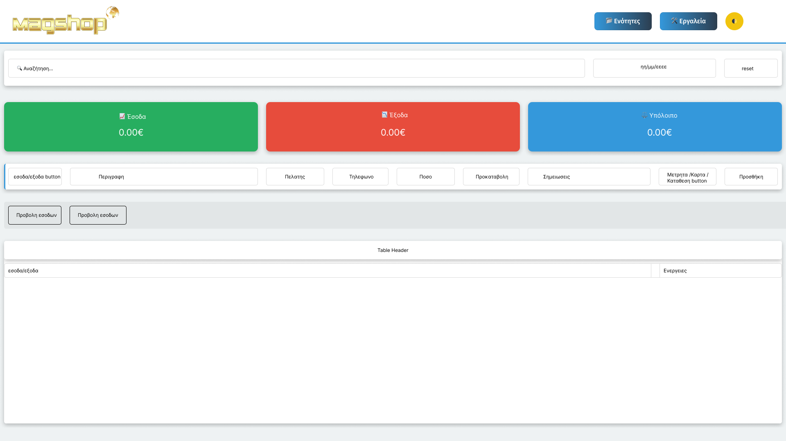
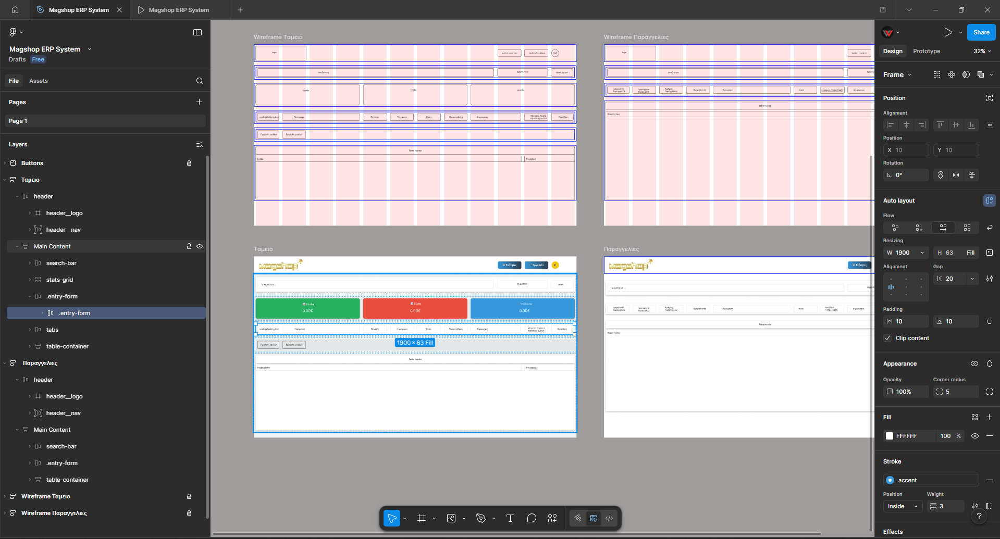
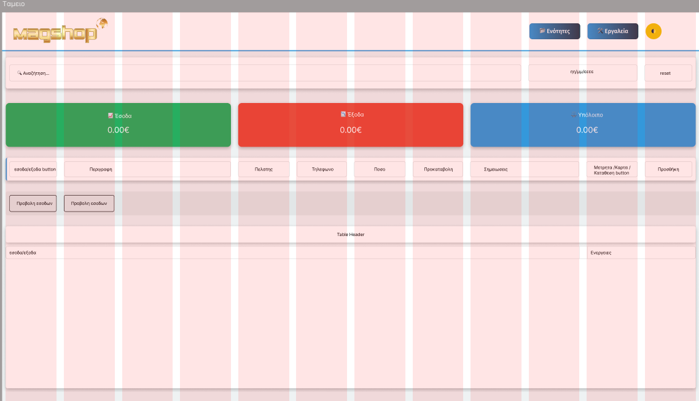
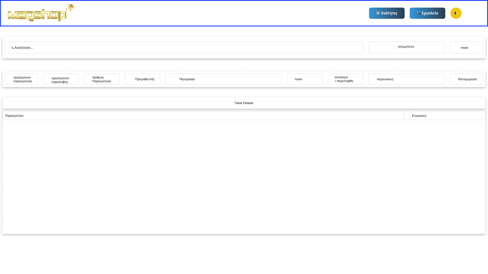
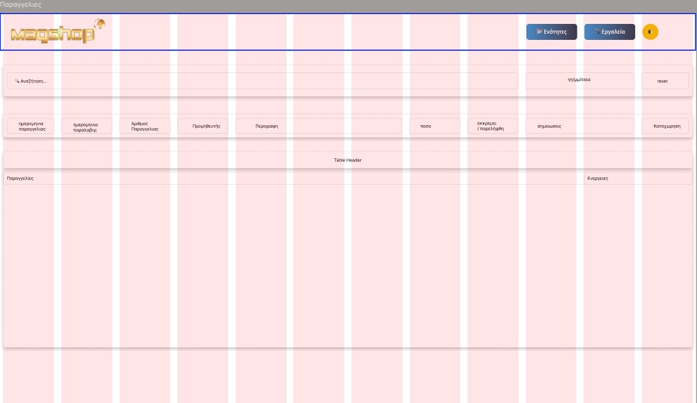
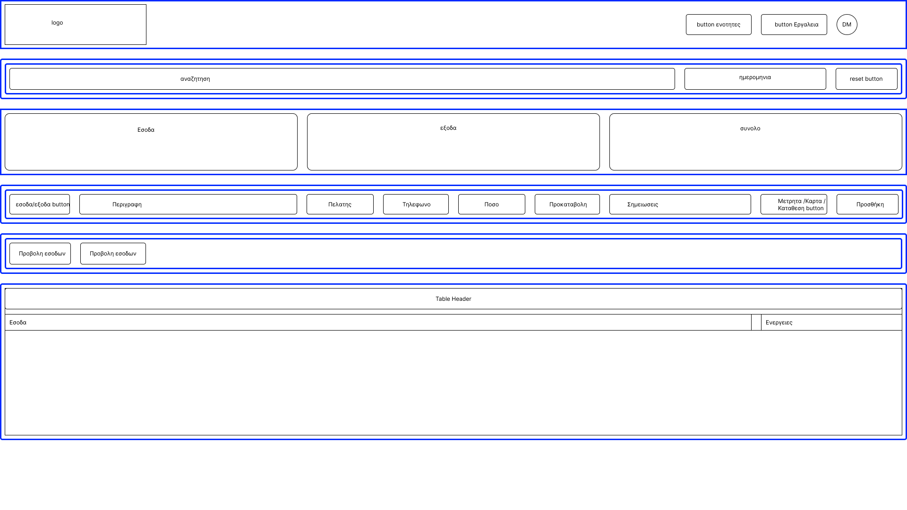
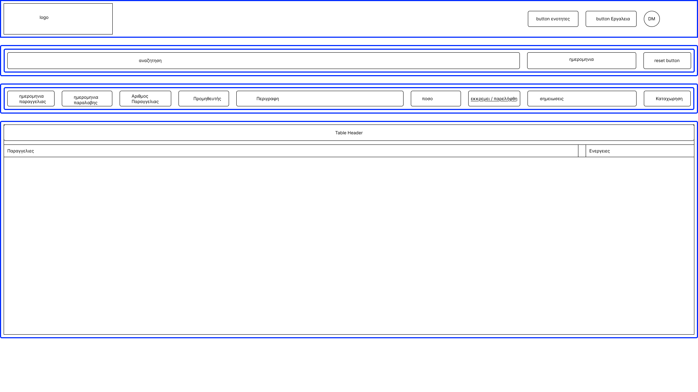

# MagShop ERP System

A modern Business ERP (Enterprise Resource Planning) System designed for small businesses. The project was developed starting from a blank canvas and evolved into a fully functional, dynamic web application.

---

## Project Overview

🔹 **Purpose:** Manage business finances and orders efficiently. 
🔹 **Target Users:** Small business owners (Retail/Wholesale). 
🔹 **Language:** Greek.

---

## Tech Stack

🔹 **HTML5** - Semantic Structure 
🔹 **CSS3** - Modern Styling, Flexbox, CSS Variables 
🔹 **JavaScript (Vanilla)** - Logic & Interactivity 
🔹 **LocalStorage** - Data persistence (No backend required) 
🔹 **VS Code** - Development Environment 
🔹 **GitHub** - Version Control

---

## Design System & UI/UX

🔹 **Theme:** Clean, professional business aesthetic. 
🔹 **Color Palette:** Navy Blue primary (`#2c3e50`) with accent blue (`#3489db`), success green (`#27ae60`), and danger red (`#e74c3c`). 
🔹 **Typography:** Segoe UI / Arial for maximum readability. 

---

## Project Workflow

### 1. Development Phase

🔹 **Version-Based Development:** Each feature is developed as a separate version for better tracking and easy rollback. 
🔹 **Manual Coding:** Every line of code is written and understood (no copy-paste without understanding). 
🔹 **AI as Learning Assistant:** AI is used as a "Senior Mentor" for explanations and best practices, not for blind code generation.

### 2. Testing & Deployment

🔹 **Live Server:** Local development with VS Code Live Server. 
🔹 **Browser Testing:** Chrome/Firefox for cross-browser compatibility. 
🔹 **GitHub Hosting:** Repository for version history and collaboration.

---

## Current Features (v1.0)

🔹 Basic HTML5 structure with semantic tags. 
🔹 Navigation between Finance and Orders sections. 
🔹 Section show/hide functionality using JavaScript. 
🔹 Clean, modern UI design with CSS Variables.

---

## Upcoming Features

🔹 **v1.1** - Income/Expense Input Forms 
🔹 **v1.2** - LocalStorage Data Persistence 
🔹 **v1.3** - Tables & Financial Statistics 
🔹 **v2.0** - Tabs for Income/Expense switching 
🔹 **v2.1** - Search & Date Filters 
🔹 **v3.0** - Order Management Module 
🔹 **v3.1** - Edit & Delete functionality 
🔹 **v4.0** - Backup & Export (JSON/CSV) 
🔹 **v5.0** - Dark Mode & Print Styles

---

## Project Preview

 

**More Screenshots**

  
<b>Click to view the full gallery / Κάντε κλικ για την πλήρη συλλογή </b>

  
  

     
     
     
     
     
     
     

  

---

## Version History

See [CHANGELOG.md](CHANGELOG.md) for detailed version history.

---

## AI-Assisted Engineering

This project uses **AI as a Learning Tool** following the **AI-Augmentation** methodology:

🔹 **Code Explanations:** AI explains each line of code for understanding. 
🔹 **Best Practices:** Suggestions for clean code, naming conventions, and structure. 
🔹 **Problem Solving:** Debug assistance and optimization tips.

> **Note:** The key principle is **"Understand before using"** - AI helps learn faster, but doesn't replace the developer's understanding.

---

## Links

🔹 **Portfolio:** [\[apospan.com\]](https://apospan.com/) 
🔹 **LinkedIn:** [\[Panagiotis Apostolelis\]](https://www.linkedin.com/in/panagiotis-apostolelis/) 
🔹 **Figma:** [\[Παναγιώτης Αποστολέλης\]](https://www.figma.com/@PanApos) 

# <<<<<<< HEAD

---

> > > > > > > 4e3ec32c6d166370480cb4b1c304518ca3604759

## 🇬🇷 Ελληνική Έκδοση

  
<b>Κάντε κλικ για να δείτε την περιγραφή στα Ελληνικά</b>

# MagShop ERP System

Ένα σύγχρονο Σύστημα ERP (Enterprise Resource Planning) σχεδιασμένο για μικρές επιχειρήσεις. Το project αναπτύχθηκε ξεκινώντας από λευκό καμβά και εξελίχθηκε σε μια πλήρως λειτουργική, δυναμική εφαρμογή.

---

## Επισκόπηση Project

🔹 **Σκοπός:** Αποτελεσματική διαχείριση οικονομικών και παραγγελιών. 
🔹 **Στόχος:** Μικρές επιχειρήσεις (Λιανική/Χονδρική). 
🔹 **Γλώσσα:** Ελληνικά.

---

## Tech Stack

🔹 **HTML5** - Σημασιολογική Δομή 
🔹 **CSS3** - Σύγχρονο Styling, Flexbox, CSS Variables 
🔹 **JavaScript (Vanilla)** - Λογική & Διαδραστικότητα 
🔹 **LocalStorage** - Αποθήκευση Δεδομένων (Χωρίς Backend) 
🔹 **VS Code** - Περιβάλλον Ανάπτυξης 
🔹 **GitHub** - Έλεγχος Εκδόσεων

---

## Design System & UI/UX

🔹 **Θέμα:** Καθαρή, επαγγελματική αισθητική. 
🔹 **Χρωματική Παλέτα:** Navy Blue βασικό (`#2c3e50`) με accent blue (`#3489db`), success green (`#27ae60`) και danger red (`#e74c3c`). 
🔹 **Τυπογραφία:** Segoe UI / Arial για μέγιστη αναγνωσιμότητα. 

---

## Ροή Εργασίας Project

### 1. Φάση Ανάπτυξης

🔹 **Ανάπτυξη βάσει Εκδόσεων:** Κάθε feature αναπτύσσεται ξεχωριστά για καλύτερη παρακολούθηση και εύκολη επιστροφή. 
🔹 **Χειροκίνητη Κωδικοποίηση:** Κάθε γραμμή κώδικα γράφεται και κατανοείται (όχι copy-paste χωρίς κατανόηση). 
🔹 **AI ως Βοηθός Μάθησης:** Το AI χρησιμοποιείται ως "Senior Μέντορας" για εξηγήσεις και best practices, όχι για τυφλή δημιουργία κώδικα.

### 2. Δοκιμή & Ανάπτυξη

🔹 **Live Server:** Τοπική ανάπτυξη με VS Code Live Server. 
🔹 **Δοκιμή Browser:** Chrome/Firefox για συμβατότητα μεταξύ browsers. 
🔹 **GitHub Hosting:** Repository για ιστορικό εκδόσεων και συνεργασία.

---

## Τρέχοντα Features (v1.0)

🔹 Βασική HTML5 δομή με σημασιολογικά tags. 
🔹 Πλοήγηση μεταξύ Ταμείου και Παραγγελιών. 
🔹 Εμφάνιση/Απόκρυψη ενοτήτων με JavaScript. 
🔹 Καθαρό, μοντέρνο UI design με CSS Variables.

---

## Μελλοντικά Features

🔹 **v1.1** - Φόρμες Εισαγωγής Εσόδων/Εξόδων 
🔹 **v1.2** - Αποθήκευση LocalStorage 
🔹 **v1.3** - Πίνακες & Οικονομικά Στατιστικά 
🔹 **v2.0** - Tabs για Εσοδα/Εξοδα 
🔹 **v2.1** - Αναζήτηση & Φίλτρα Ημερομηνίας 
🔹 **v3.0** - Module Διαχείρισης Παραγγελιών 
🔹 **v3.1** - Λειτουργίες Επεξεργασίας & Διαγραφής 
🔹 **v4.0** - Backup & Export (JSON/CSV) 
🔹 **v5.0** - Dark Mode & Στυλ Εκτύπωσης

---

## Ιστορικό Εκδόσεων

Δείτε το [CHANGELOG.md](CHANGELOG.md) για αναλυτικό ιστορικό εκδόσεων.

---

## AI-Assisted Engineering

Αυτό το project χρησιμοποιεί **AI ως Εργαλείο Μάθησης** ακολουθώντας τη μεθοδολογία **AI-Augmentation**:

🔹 **Εξηγήσεις Κώδικα:** Το AI εξηγεί κάθε γραμμή κώδικα για κατανόηση. 
🔹 **Best Practices:** Προτάσεις για καθαρό κώδικα, naming conventions και δομή. 
🔹 **Επίλυση Προβλημάτων:** Βοήθεια στο debugging και tips βελτιστοποίησης.

> **Σημείωση:** Η βασική αρχή είναι **"Κατανόησε πριν χρησιμοποιήσεις"** - Το AI βοηθά να μάθεις γρηγορότερα, αλλά δεν αντικαθιστά την κατανόηση του developer.

---

## Σύνδεσμοι

🔹 **Portfolio:** [\[apospan.com\]](https://apospan.com/) 
🔹 **LinkedIn:** [\[Panagiotis Apostolelis\]](https://www.linkedin.com/in/panagiotis-apostolelis/) 
🔹 **Figma:** [\[Παναγιώτης Αποστολέλης\]](https://www.figma.com/@PanApos) 

---

