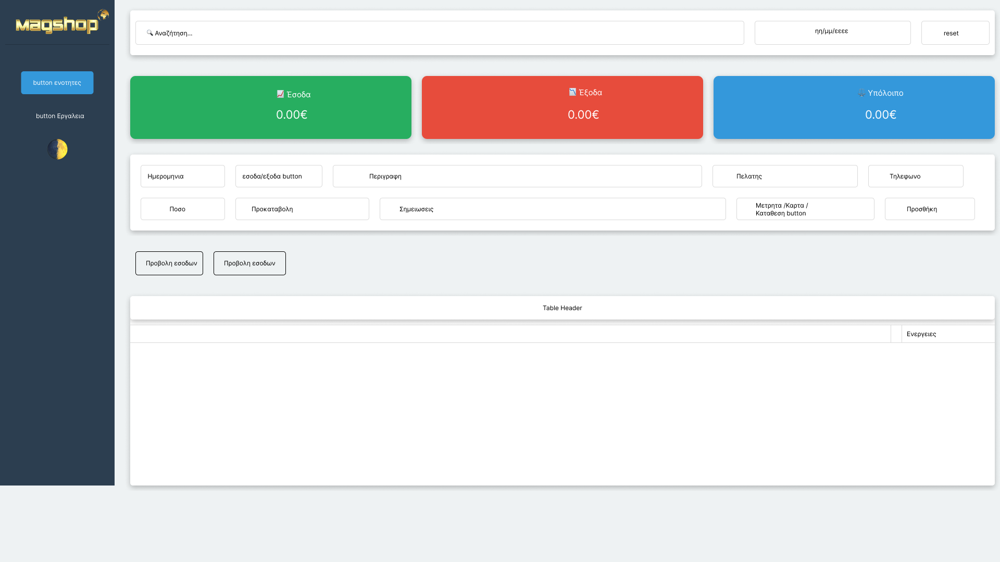
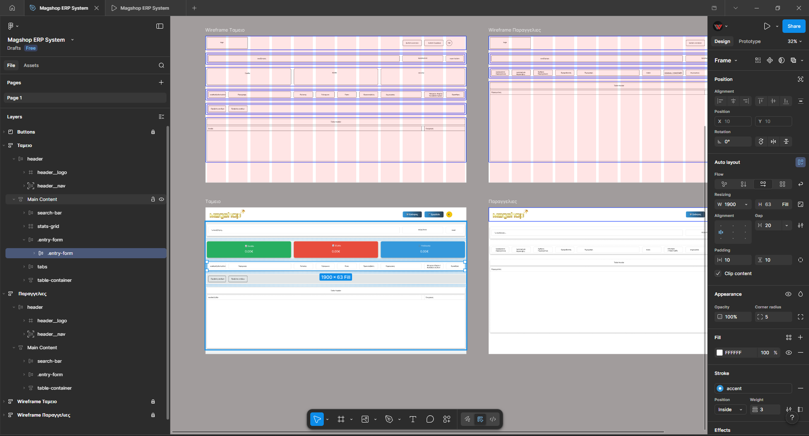
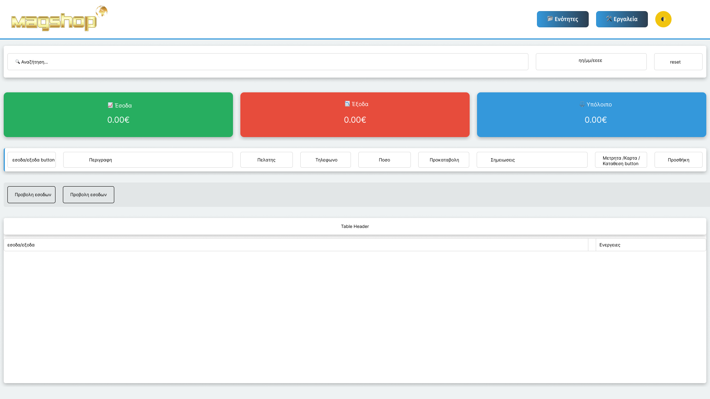
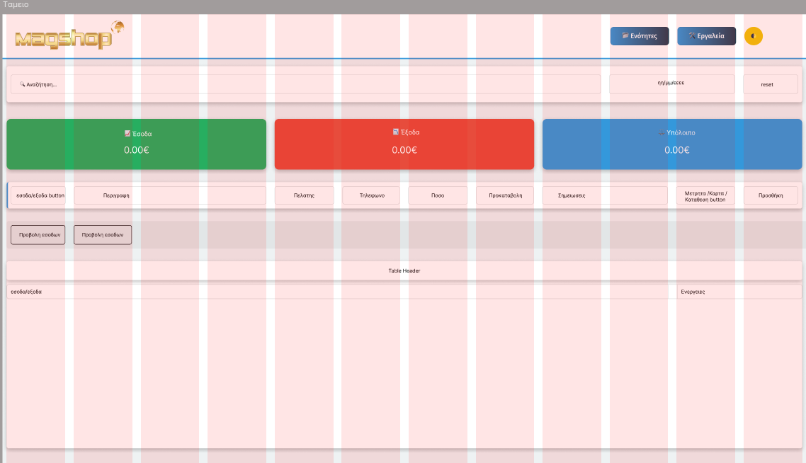
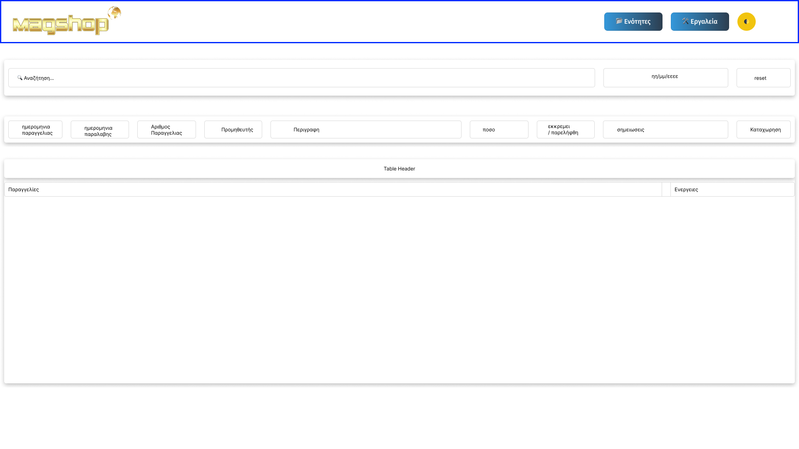
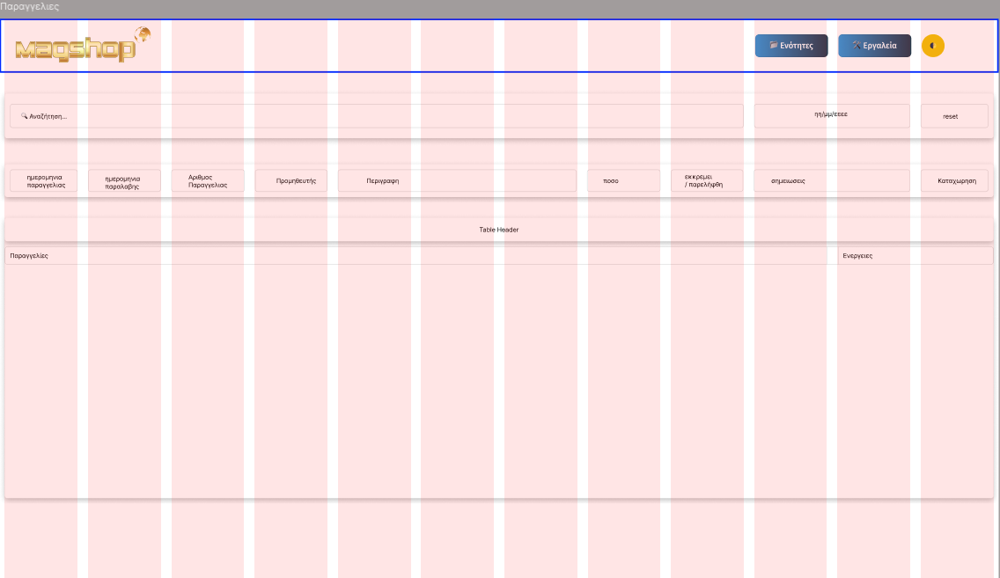
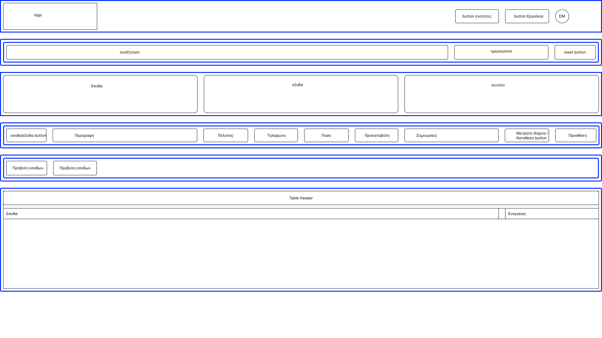
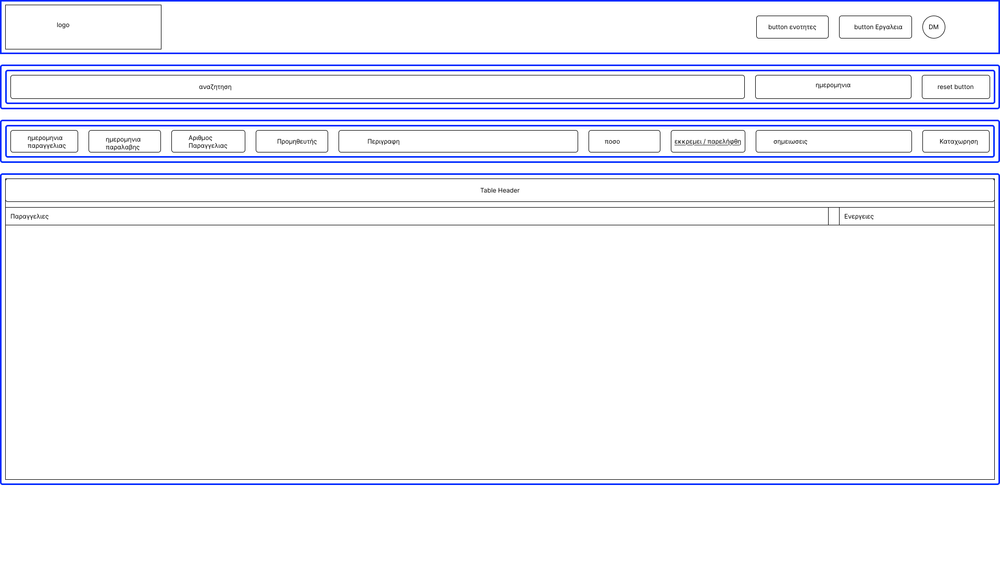

# MagShop ERP System

A modern Business ERP (Enterprise Resource Planning) System designed for small businesses. Developed from a blank canvas, evolving into a fully functional desktop web application.
(Optimized for Desktop Experience)

> **⚠️ Project Status: Completed at v5.0**
> Development concluded at v5.0. See [Why v5.0 is the final version](#-why-v50-is-the-final-version) for details.

---

## Project Overview

🔹 **Purpose:** Manage business finances and orders efficiently. 
🔹 **Target Users:** Small business owners (Retail/Wholesale). 
🔹 **Language:** Greek. 
🔹 **Platform:** Desktop Web Application (Browser-based)

---

## Tech Stack

🔹 **HTML5** - Semantic Structure 
🔹 **CSS3** - Modern Styling, Flexbox, CSS Variables, Dark Mode 
🔹 **JavaScript (Vanilla)** - Logic & Interactivity 
🔹 **LocalStorage** - Data persistence (No backend required) 
🔹 **VS Code** - Development Environment 
🔹 **GitHub** - Version Control

---

## Current Features (v5.0 — Final)

🔹 Sidebar Dashboard layout with Dark/Light Mode toggle. 
🔹 Income & Expense management with downpayment logic. 
🔹 Orders module with status tracking (Pending / Received). 
🔹 Full CRUD — Add, Edit, Delete for all records. 
🔹 Real-time financial statistics (Income / Expense / Balance). 
🔹 Search, Date filter & reset for both modules. 
🔹 JSON Backup & Restore — full data portability. 
🔹 Excel (CSV) Export with Greek character support. 
🔹 TXT Report Export. 
🔹 LocalStorage persistence with versioned keys.

---

## Design System & UI/UX

🔹 **Theme:** Clean, professional business aesthetic + Dark Mode (Black/Gold). 
🔹 **Color Palette:** Navy Blue primary (`#2c3e50`), accent blue (`#3498db`), success green (`#27ae60`), danger red (`#e74c3c`), gold (`#C49543`). 
🔹 **Typography:** Segoe UI / Arial for maximum readability. 
🔹 **Design Tool:** Figma (Wireframes & Final Design before coding)

---

## Project Workflow

### 1. Development Phase

🔹 **Version-Based Development:** Each feature developed as a separate version for tracking and rollback. 
🔹 **Manual Coding:** Every line of code written and understood — no blind copy-paste. 
🔹 **AI as Learning Assistant:** Used as a "Senior Mentor" for explanations and best practices, not for code generation.

### 2. Testing & Deployment

🔹 **Live Server:** Local development with VS Code Live Server. 
🔹 **Browser Testing:** Chrome/Firefox for cross-browser compatibility. 
🔹 **GitHub Hosting:** Repository for version history and collaboration.

---

## 🛑 Why v5.0 is the Final Version

The original roadmap included **v6.0 — Electron.js Desktop Application**. During the attempt to package the app as a Windows `.exe`, a real-world obstacle was encountered: **Windows SmartScreen** blocks unsigned executables.

**The options were:**
- EV Code Signing Certificate → ~€400/year
- Standard Certificate → ~€100/year (partial protection)
- Self-Signed Certificate → requires manual installation by each user (not viable)

For a study case at this stage, none of these options were justified. This is a **real engineering decision** — not every project needs to reach its final form to deliver value.

**What this project achieved:**
- Full CRUD web application from scratch
- Professional Dashboard UI/UX design
- Data portability (Backup/Restore/Export)
- Dark Mode with CSS Variables
- Version-based development methodology

The project is **complete and functional** as a browser-based desktop application.

---

## Roadmap — Completed

🔹 **v1.1** - Basic Layout ✅ 
🔹 **v1.2** - LocalStorage & Core ✅ 
🔹 **v2.0** - Income/Expense Tabs & Form Expansion ✅ 
🔹 **v3.0** - Orders Module ✅ 
🔹 **v3.1** - Sidebar Dashboard Layout ✅ 
🔹 **v4.0** - Edit Functionality & Downpayment Logic ✅ 
🔹 **v5.0** - Backup/Export + Dark Mode ✅ 
🔹 **v6.0** - Electron.js Desktop App ⛔ (Code Signing cost — not justified at this stage)

---

## Project Preview

 

**More Screenshots**

  
<b>Click to view the full gallery</b>

  
  

     
     
     
     
     
     
     
  

---

## Version History

See [CHANGELOG.md](CHANGELOG.md) for detailed version history.

---

## Links

🔹 **Portfolio:** [apospan.com](https://apospan.com/) 
🔹 **LinkedIn:** [Panagiotis Apostolelis](https://www.linkedin.com/in/panagiotis-apostolelis/) 
🔹 **Figma:** [Παναγιώτης Αποστολέλης](https://www.figma.com/@PanApos) 

---

## 🇬🇷 Ελληνική Έκδοση

<b>Κάντε κλικ για να δείτε την περιγραφή στα Ελληνικά</b>

# MagShop ERP System

Ένα σύγχρονο Σύστημα ERP σχεδιασμένο για μικρές επιχειρήσεις. Αναπτύχθηκε από μηδενική βάση και εξελίχθηκε σε πλήρως λειτουργική desktop web εφαρμογή.

> **⚠️ Κατάσταση Project: Ολοκληρώθηκε στο v5.0**

---

## Επισκόπηση Project

🔹 **Σκοπός:** Αποτελεσματική διαχείριση οικονομικών και παραγγελιών. 
🔹 **Στόχος:** Μικρές επιχειρήσεις (Λιανική/Χονδρική). 
🔹 **Γλώσσα:** Ελληνικά. 
🔹 **Πλατφόρμα:** Desktop Web Application (Browser-based)

---

## Τρέχοντα Features (v5.0 — Final)

🔹 Sidebar Dashboard με Dark/Light Mode. 
🔹 Διαχείριση Εσόδων/Εξόδων με λογική προκαταβολής. 
🔹 Module Παραγγελιών με tracking κατάστασης. 
🔹 Πλήρες CRUD — Προσθήκη, Επεξεργασία, Διαγραφή. 
🔹 Real-time στατιστικά (Έσοδα / Έξοδα / Υπόλοιπο). 
🔹 Search & Date filter και στα δύο modules. 
🔹 JSON Backup & Restore. 
🔹 Export σε Excel (CSV) με υποστήριξη Ελληνικών. 
🔹 Export σε TXT Report.

---

## 🛑 Γιατί το v5.0 είναι η τελική έκδοση

Ο αρχικός roadmap περιλάμβανε **v6.0 — Electron.js Desktop Application**. Κατά την προσπάθεια δημιουργίας Windows `.exe`, προέκυψε ένα πραγματικό εμπόδιο: το **Windows SmartScreen** μπλοκάρει unsigned εκτελέσιμα.

**Οι επιλογές ήταν:**
- EV Code Signing Certificate → ~€400/χρόνο
- Standard Certificate → ~€100/χρόνο
- Self-Signed Certificate → απαιτεί manual εγκατάσταση από κάθε χρήστη

Για study case σε αυτό το στάδιο, καμία επιλογή δεν δικαιολογείτο. Αυτή είναι μια **πραγματική μηχανολογική απόφαση** — δεν χρειάζεται κάθε project να φτάσει στην τελική του μορφή για να έχει αξία.

---

## Roadmap — Ολοκληρωμένο

🔹 **v1.1** - Βασικό Layout ✅ 
🔹 **v1.2** - LocalStorage & Core ✅ 
🔹 **v2.0** - Tabs Εσόδων/Εξόδων ✅ 
🔹 **v3.0** - Module Παραγγελιών ✅ 
🔹 **v3.1** - Sidebar Dashboard Layout ✅ 
🔹 **v4.0** - Edit Functionality ✅ 
🔹 **v5.0** - Backup/Export + Dark Mode ✅ 
🔹 **v6.0** - Electron.js Desktop App ⛔ (Κόστος Code Signing)

---

## Σύνδεσμοι

🔹 **Portfolio:** [apospan.com](https://apospan.com/) 
🔹 **LinkedIn:** [Panagiotis Apostolelis](https://www.linkedin.com/in/panagiotis-apostolelis/) 
🔹 **Figma:** [Παναγιώτης Αποστολέλης](https://www.figma.com/@PanApos)

---

